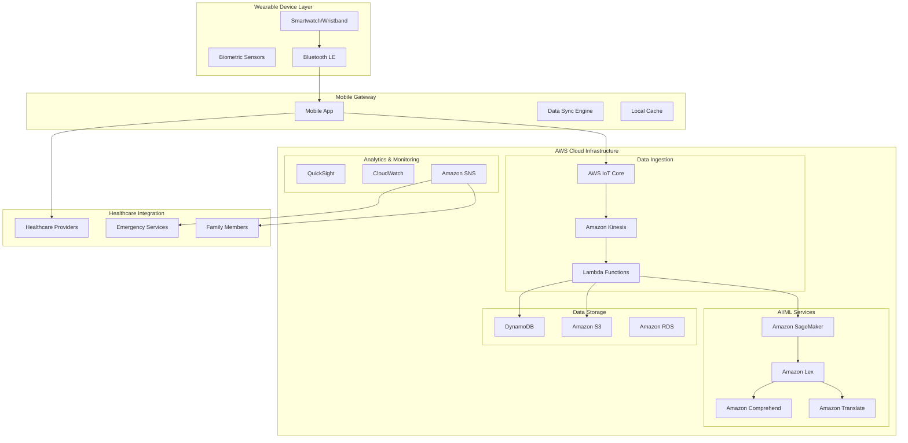

# Design Document: AI-Powered Pulmonary Care Wearable System

## Overview

The AI-powered pulmonary care system is a comprehensive healthcare solution designed for the AI for Bharat AWS Hackathon. The system integrates wearable technology, artificial intelligence, and AWS cloud infrastructure to provide continuous pulmonary health monitoring and personalized care guidance specifically tailored for the Indian healthcare context.

The solution consists of four main components:
1. **Wearable Device Layer** - Smartwatch/wristband for real-time biometric data collection
2. **AI Chatbot Engine** - Multi-language conversational AI for personalized health guidance
3. **AWS Cloud Infrastructure** - Scalable backend for data processing, ML inference, and storage
4. **Mobile Application** - Companion app for detailed analytics and healthcare provider integration

The system addresses critical gaps in pulmonary care accessibility in India by providing continuous monitoring, early warning systems, and culturally appropriate health guidance in multiple Indian languages.

## Architecture

### High-Level System Architecture



### AWS Services Architecture

The system leverages multiple AWS services to ensure scalability, reliability, and compliance:

**Data Ingestion Tier:**
- **AWS IoT Core**: Secure device connectivity and message routing
- **Amazon Kinesis Data Streams**: Real-time data streaming and processing
- **AWS Lambda**: Serverless compute for data transformation and routing

**AI/ML Tier:**
- **Amazon SageMaker**: ML model training, hosting, and inference
- **Amazon Lex**: Conversational AI chatbot framework
- **Amazon Comprehend**: Natural language processing for health queries
- **Amazon Translate**: Multi-language support for Indian languages

**Storage Tier:**
- **Amazon DynamoDB**: Real-time health data storage with millisecond latency
- **Amazon S3**: Historical data archival and ML model artifacts
- **Amazon RDS**: Structured data for user profiles and healthcare provider information

**Security & Compliance:**
- **AWS KMS**: Encryption key management for HIPAA compliance
- **AWS IAM**: Identity and access management
- **AWS CloudTrail**: Audit logging for compliance requirements

## Components and Interfaces

### Wearable Device Component

**Hardware Specifications:**
- Heart rate sensor (PPG-based) with 1Hz+ sampling rate
- SpO2 sensor for blood oxygen saturation measurement
- 3-axis accelerometer for activity and respiratory pattern detection
- Bluetooth 5.0 LE for low-power communication
- 7-day battery life with continuous monitoring
- IP68 water resistance rating

**Software Stack:**
- Real-time operating system (RTOS) for sensor data collection
- Edge computing capabilities for basic anomaly detection
- Secure communication protocols with AES-256 encryption
- Local data buffering for offline scenarios

**Data Collection Interface:**
```typescript
interface BiometricData {
  deviceId: string;
  timestamp: number;
  heartRate: number;
  spO2: number;
  respiratoryRate: number;
  activityLevel: ActivityLevel;
  batteryLevel: number;
  dataQuality: QualityMetrics;
}

interface QualityMetrics {
  signalStrength: number;
  motionArtifact: boolean;
  sensorContact: boolean;
}
```

### AI Chatbot Engine

**Natural Language Processing Pipeline:**
- **Input Processing**: Multi-language speech-to-text using Amazon Transcribe
- **Intent Recognition**: Amazon Lex for understanding user queries and health concerns
- **Context Management**: Conversation state management with user health history
- **Response Generation**: Contextual health advice generation using fine-tuned LLMs
- **Output Processing**: Text-to-speech in user's preferred Indian language

**Supported Languages:**
- Hindi, Tamil, Telugu, Bengali, Marathi, English
- Regional dialect adaptation using Amazon Comprehend
- Cultural context awareness for health advice

**Chatbot Interface:**
```typescript
interface ChatbotRequest {
  userId: string;
  message: string;
  language: SupportedLanguage;
  context: HealthContext;
  urgencyLevel: UrgencyLevel;
}

interface ChatbotResponse {
  message: string;
  language: SupportedLanguage;
  actionRequired: boolean;
  escalationNeeded: boolean;
  followUpScheduled: boolean;
}

interface HealthContext {
  recentVitals: BiometricData[];
  medicalHistory: MedicalRecord[];
  currentMedications: Medication[];
  riskFactors: RiskFactor[];
}
```

### Machine Learning Models

**Predictive Health Analytics:**
1. **Pulmonary Exacerbation Prediction Model**
   - Input: 48-hour vital sign trends, environmental data, medication adherence
   - Output: Risk score (0-100) with 24-48 hour prediction window
   - Algorithm: Gradient boosting with time series features

2. **Anomaly Detection Model**
   - Input: Real-time biometric streams
   - Output: Anomaly score and classification
   - Algorithm: Isolation Forest with streaming updates

3. **Personalization Model**
   - Input: User behavior, health responses, cultural preferences
   - Output: Personalized health recommendations
   - Algorithm: Collaborative filtering with health domain constraints

**Model Training Pipeline:**
```python
# Pseudocode for ML pipeline
class PulmonaryHealthModel:
    def __init__(self):
        self.feature_extractor = TimeSeriesFeatureExtractor()
        self.model = GradientBoostingRegressor()
        self.scaler = StandardScaler()
    
    def train(self, health_data, outcomes):
        features = self.feature_extractor.extract(health_data)
        scaled_features = self.scaler.fit_transform(features)
        self.model.fit(scaled_features, outcomes)
    
    def predict_risk(self, current_data):
        features = self.feature_extractor.extract(current_data)
        scaled_features = self.scaler.transform(features)
        return self.model.predict_proba(scaled_features)
```

### Healthcare Provider Integration

**Provider Dashboard Interface:**
- Real-time patient monitoring dashboard
- Alert management system with severity levels
- Historical health trend visualization
- Telemedicine integration capabilities

**Emergency Response System:**
- Automated emergency service notification
- GPS location sharing with first responders
- Medical history and current medication information sharing
- Real-time vital sign streaming during emergencies

**Integration APIs:**
```typescript
interface ProviderAPI {
  getPatientVitals(patientId: string, timeRange: TimeRange): Promise<BiometricData[]>;
  subscribeToAlerts(providerId: string, patientIds: string[]): Promise<AlertSubscription>;
  updateTreatmentPlan(patientId: string, plan: TreatmentPlan): Promise<void>;
  scheduleFollowUp(patientId: string, appointment: Appointment): Promise<void>;
}

interface EmergencyAPI {
  triggerEmergencyAlert(patientId: string, severity: EmergencySeverity): Promise<void>;
  shareLocationData(patientId: string, coordinates: GeoLocation): Promise<void>;
  streamVitalSigns(patientId: string): Promise<VitalSignStream>;
}
```

## Data Models

### Core Health Data Model

```typescript
interface Patient {
  patientId: string;
  personalInfo: PersonalInfo;
  medicalHistory: MedicalHistory;
  deviceInfo: DeviceInfo;
  preferences: UserPreferences;
  emergencyContacts: EmergencyContact[];
}

interface PersonalInfo {
  name: string;
  dateOfBirth: Date;
  gender: Gender;
  height: number;
  weight: number;
  bloodType: BloodType;
  allergies: string[];
}

interface MedicalHistory {
  pulmonaryConditions: PulmonaryCondition[];
  medications: Medication[];
  hospitalizations: Hospitalization[];
  familyHistory: FamilyMedicalHistory[];
  riskFactors: RiskFactor[];
}

interface PulmonaryCondition {
  condition: ConditionType;
  diagnosisDate: Date;
  severity: SeverityLevel;
  treatmentPlan: TreatmentPlan;
  lastExacerbation: Date;
}

interface BiometricReading {
  readingId: string;
  patientId: string;
  deviceId: string;
  timestamp: Date;
  heartRate: number;
  spO2: number;
  respiratoryRate: number;
  bloodPressure?: BloodPressure;
  temperature?: number;
  activityLevel: ActivityLevel;
  location?: GeoLocation;
  dataQuality: QualityScore;
}

interface HealthAlert {
  alertId: string;
  patientId: string;
  alertType: AlertType;
  severity: SeverityLevel;
  timestamp: Date;
  triggerData: BiometricReading;
  actionTaken: AlertAction[];
  resolved: boolean;
  resolvedBy?: string;
}
```

### ML Model Data Structures

```typescript
interface FeatureVector {
  patientId: string;
  timestamp: Date;
  vitalSignFeatures: VitalSignFeatures;
  temporalFeatures: TemporalFeatures;
  environmentalFeatures: EnvironmentalFeatures;
  behavioralFeatures: BehavioralFeatures;
}

interface VitalSignFeatures {
  heartRateStats: StatisticalFeatures;
  spO2Stats: StatisticalFeatures;
  respiratoryRateStats: StatisticalFeatures;
  heartRateVariability: HRVFeatures;
}

interface PredictionResult {
  patientId: string;
  predictionId: string;
  timestamp: Date;
  modelVersion: string;
  riskScore: number;
  confidence: number;
  timeHorizon: number;
  riskFactors: RiskFactor[];
  recommendations: Recommendation[];
}
```

### Database Schema Design

**DynamoDB Tables:**
1. **PatientProfiles** (Partition Key: patientId)
2. **BiometricReadings** (Partition Key: patientId, Sort Key: timestamp)
3. **HealthAlerts** (Partition Key: patientId, Sort Key: timestamp)
4. **MLPredictions** (Partition Key: patientId, Sort Key: predictionTimestamp)
5. **ChatbotSessions** (Partition Key: sessionId, Sort Key: messageTimestamp)

**RDS Tables:**
1. **HealthcareProviders** - Provider information and credentials
2. **EmergencyContacts** - Emergency contact relationships
3. **MedicalHistory** - Structured medical history data
4. **AuditLogs** - Compliance and audit trail information

## Correctness Properties

*A property is a characteristic or behavior that should hold true across all valid executions of a system—essentially, a formal statement about what the system should do. Properties serve as the bridge between human-readable specifications and machine-verifiable correctness guarantees.*

Based on the prework analysis of acceptance criteria, the following properties ensure system correctness:

### Data Collection and Quality Properties

**Property 1: Continuous Heart Rate Monitoring**
*For any* time period when the wearable device is worn and active, the Health_Monitor should collect heart rate data at minimum 1Hz frequency with proper UTC timestamps.
**Validates: Requirements 1.1, 1.5**

**Property 2: SpO2 Measurement Intervals**
*For any* active monitoring session, the Health_Monitor should measure blood oxygen saturation every 30 seconds (±2 seconds tolerance).
**Validates: Requirements 1.2**

**Property 3: Respiratory Rate Calculation Accuracy**
*For any* detected respiratory pattern, the calculated respiratory rate should be within ±2 breaths per minute of the actual rate.
**Validates: Requirements 1.3**

**Property 4: Power Management Behavior**
*For any* battery level below 20%, the system should notify the user and reduce sampling frequency while maintaining critical monitoring capabilities.
**Validates: Requirements 1.6**

### AI Chatbot Response Properties

**Property 5: Multi-Language Response Consistency**
*For any* user interaction, the AI_Chatbot should respond in the user's preferred Indian language with culturally appropriate medical terminology.
**Validates: Requirements 2.1, 9.1, 9.3**

**Property 6: Contextual Health Advice**
*For any* health anomaly detection, the AI_Chatbot should provide advice that incorporates the user's medical history and current health context.
**Validates: Requirements 2.2**

**Property 7: Response Time Performance**
*For any* health question, the AI_Chatbot should provide evidence-based responses within 3 seconds.
**Validates: Requirements 2.6**

### Cloud Infrastructure Performance Properties

**Property 8: Data Processing Latency**
*For any* data received from wearables, the Cloud_Infrastructure should process it through AWS IoT Core within 100ms.
**Validates: Requirements 3.1**

**Property 9: ML Inference Performance**
*For any* ML inference request, the Cloud_Infrastructure should return results from SageMaker endpoints within 1 second.
**Validates: Requirements 3.2**

**Property 10: Data Storage Routing**
*For any* incoming health data, the system should route real-time data to DynamoDB and historical data to S3 based on data type and access patterns.
**Validates: Requirements 3.3**

### Alert System Properties

**Property 11: Critical Threshold Alerting**
*For any* SpO2 reading below 90% or other critical vital sign thresholds, the Alert_System should immediately notify healthcare providers and emergency contacts.
**Validates: Requirements 4.1, 10.1**

**Property 12: Emergency Response Coordination**
*For any* multi-parameter emergency condition, the system should automatically contact emergency services with patient location and medical history.
**Validates: Requirements 4.4, 10.2**

**Property 13: Alert Audit Trail**
*For any* alert sent by the system, all notification details should be logged for audit and compliance purposes.
**Validates: Requirements 4.6**

### Healthcare Provider Integration Properties

**Property 14: Provider Authentication**
*For any* healthcare provider access attempt, the system should require and verify multi-factor authentication before granting access to patient data.
**Validates: Requirements 5.1**

**Property 15: Consent-Based Data Sharing**
*For any* patient consent configuration, the system should only share health data with explicitly authorized healthcare providers.
**Validates: Requirements 5.2**

### Mobile Application Properties

**Property 16: Real-Time Data Synchronization**
*For any* mobile app launch, the displayed health metrics should be synchronized with the wearable device within 5 seconds.
**Validates: Requirements 6.1**

**Property 17: Offline Data Caching**
*For any* offline mode activation, the mobile app should cache essential data and synchronize all changes when connectivity returns.
**Validates: Requirements 6.5**

### Machine Learning Model Properties

**Property 18: Prediction Accuracy and Timeliness**
*For any* patient with sufficient historical data (>30 days), the ML_Model should predict pulmonary exacerbations 24-48 hours in advance with >80% accuracy.
**Validates: Requirements 7.1**

**Property 19: Environmental Risk Adjustment**
*For any* change in environmental factors (air quality, weather), the ML_Model should adjust risk assessments within 1 hour of data availability.
**Validates: Requirements 7.2**

**Property 20: Model Transparency**
*For any* prediction made by the ML_Model, confidence scores and explanations should be provided to healthcare providers.
**Validates: Requirements 7.6**

### Security and Compliance Properties

**Property 21: Data Encryption in Transit**
*For any* health data transmission, the Compliance_Engine should encrypt all data using AES-256 encryption.
**Validates: Requirements 8.1**

**Property 22: HIPAA Compliance Enforcement**
*For any* data storage operation, the Compliance_Engine should ensure HIPAA compliance with proper audit trails and access controls.
**Validates: Requirements 8.2**

**Property 23: Data Retention Policy Enforcement**
*For any* data retention policy, the Compliance_Engine should automatically delete expired data according to regulatory requirements.
**Validates: Requirements 8.5**

<function_calls>
<invoke name="prework">
<parameter name="featureName">pulmonary-care-ai-wearable

## Error Handling

### Wearable Device Error Handling

**Sensor Failure Recovery:**
- Automatic sensor recalibration when data quality degrades
- Graceful degradation to available sensors when one fails
- User notification for persistent sensor issues requiring device replacement

**Connectivity Loss Management:**
- Local data buffering for up to 24 hours of continuous monitoring
- Automatic reconnection attempts with exponential backoff
- Priority data transmission when connectivity resumes (critical alerts first)

**Battery Management:**
- Progressive power saving modes at 30%, 20%, and 10% battery levels
- Critical alert preservation even in ultra-low power mode
- Predictive battery life notifications based on usage patterns

### Cloud Infrastructure Error Handling

**Service Availability:**
- Multi-region deployment with automatic failover
- Circuit breaker patterns for external service dependencies
- Graceful degradation when non-critical services are unavailable

**Data Processing Errors:**
- Dead letter queues for failed message processing
- Automatic retry with exponential backoff for transient failures
- Data validation and sanitization at ingestion points

**ML Model Failures:**
- Fallback to previous model versions when new deployments fail
- Conservative health recommendations when model confidence is low
- Manual override capabilities for healthcare providers

### Mobile Application Error Handling

**Network Connectivity:**
- Offline mode with local data caching
- Progressive data synchronization when connectivity returns
- User-friendly error messages for network issues

**Data Synchronization Conflicts:**
- Timestamp-based conflict resolution for health data
- User confirmation for critical data discrepancies
- Audit trail for all data synchronization events

## Testing Strategy

### Dual Testing Approach

The system employs both unit testing and property-based testing to ensure comprehensive coverage:

**Unit Tests:**
- Specific examples and edge cases for individual components
- Integration points between system components
- Error conditions and boundary value testing
- Healthcare provider workflow validation

**Property-Based Tests:**
- Universal properties verified across randomized inputs
- Minimum 100 iterations per property test
- Comprehensive input coverage through automated generation
- Each test tagged with corresponding design property

### Property-Based Testing Configuration

**Testing Framework:** 
- **Python**: Hypothesis for backend services and ML models
- **TypeScript**: fast-check for mobile app and API testing
- **AWS Services**: Custom property generators for cloud infrastructure testing

**Test Execution:**
- Minimum 100 iterations per property test
- Randomized input generation with health-domain constraints
- Continuous integration pipeline with property test execution
- Performance benchmarking integrated with property validation

**Property Test Tagging:**
Each property-based test must include a comment referencing its design document property:
```python
# Feature: pulmonary-care-ai-wearable, Property 1: Continuous Heart Rate Monitoring
@given(monitoring_sessions=health_monitoring_strategy())
def test_heart_rate_collection_frequency(monitoring_sessions):
    # Test implementation
```

### Healthcare Domain Testing

**Synthetic Health Data Generation:**
- Realistic biometric data patterns for various pulmonary conditions
- Edge case generation for critical health scenarios
- Privacy-preserving synthetic patient profiles

**Compliance Testing:**
- HIPAA audit trail validation
- Data encryption verification across all transmission paths
- Access control testing with various user roles

**Performance Testing:**
- Load testing with simulated patient populations (1M+ concurrent users)
- Latency testing for critical alert pathways
- Scalability testing for AWS infrastructure components

### Integration Testing

**Healthcare Provider Integration:**
- End-to-end testing with mock healthcare provider systems
- Emergency service notification testing with simulation environments
- Telemedicine platform integration validation

**Multi-Language Testing:**
- Automated testing across all supported Indian languages
- Cultural appropriateness validation for health advice
- Voice recognition accuracy testing for regional dialects

**Device Integration Testing:**
- Wearable device simulation for various hardware configurations
- Bluetooth connectivity testing under different conditions
- Battery life simulation and power management validation

The testing strategy ensures that both specific examples (unit tests) and universal behaviors (property tests) are validated, providing comprehensive coverage for this critical healthcare system.